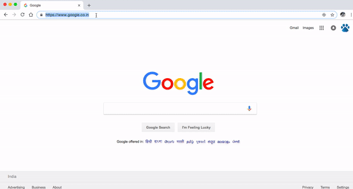

# usgsApp

Technologies
1) Angular 7
2) Express 4
3) Node 10

USGS (US Geological Survey) publishes various earthquake data as JSON feed. Here’s a feed spanning all domestic earthquakes from the past week:

https://earthquake.usgs.gov/earthquakes/feed/v1.0/summary/all_week.geojson

Using this JSON feed:

1) identify every earthquake in California from past week,

2) list them chronologically (ascending). 

Write a simple node js application with CSS that highlights data for a given magnitude or higher (Magnitude Filter is a textbox in which user can type in numbers).
